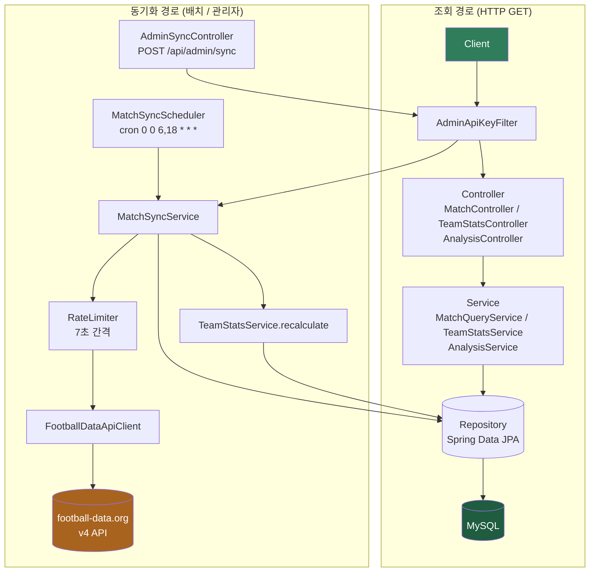
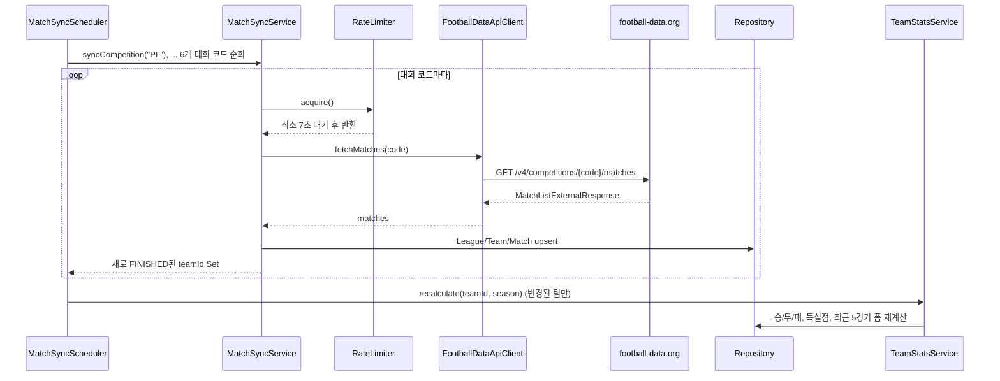
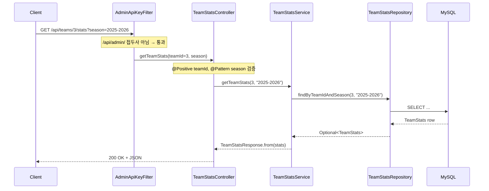

# FotData 백엔드 아키텍처

기준: `Bn/src/main/java/com/fotdata` (2026-07-30)

해외축구(EPL·라리가·분데스리가·세리에A·리그1·UEFA 챔피언스리그) 경기 데이터를 football-data.org에서 수집해 저장하고, 팀 성적·순위·상대전적을 계산해 REST API로 제공하는 Spring Boot 백엔드.

## 1. 계층 구조

요청은 위에서 아래로 흐르고, 각 계층은 바로 아래 계층만 알고 있다. 배치 수집은 Controller를 거치지 않는 별도 경로다.

| 계층 | 역할 | 주요 클래스 |
|---|---|---|
| Filter | 모든 요청 선처리, `/api/admin/**`만 `X-Admin-Key` 헤더 검사 | `AdminApiKeyFilter` |
| Controller | REST 엔드포인트, `@Validated`로 파라미터 검증 | `MatchController`, `TeamStatsController`, `AnalysisController`, `AdminSyncController` |
| Service | 트랜잭션 경계, 도메인 로직 | `MatchQueryService`, `TeamStatsService`, `AnalysisService`, `MatchSyncService`, `SeasonCalculator` |
| Repository | Spring Data JPA 인터페이스 | `MatchRepository`, `TeamRepository`, `TeamStatsRepository`, `LeagueRepository` |
| DB | 영속 저장소 | `league` / `team` / `match_result` / `team_stats` |

## 2. 데이터 수집 흐름 (동기화 시퀀스)

경기 종료(`status → FINISHED`) 시점에만 `TeamStats`를 다시 계산하도록 `MatchSyncService.upsertMatch()`가 변화된 팀 ID만 모아 전달한다. 전체 팀을 매번 재계산하지 않는다.

## 3. API 엔드포인트

| Method | Path | 검증 | 보호 |
|---|---|---|---|
| GET | `/api/matches` | leagueId(양수), matchday(양수) | - |
| GET | `/api/teams/{teamId}/stats` | teamId(양수), season(`YYYY-YYYY`) | - |
| GET | `/api/analysis/rankings/top-scorers` | leagueId(양수), season(패턴) | - |
| GET | `/api/analysis/rankings/top-conceders` | leagueId(양수), season(패턴) | - |
| GET | `/api/analysis/h2h` | teamAId, teamBId(양수) | - |
| POST | `/api/admin/sync` | leagueCode(NotBlank) | `X-Admin-Key` 헤더 |

검증 실패(`ConstraintViolationException`)는 400, 리소스 없음(`IllegalArgumentException`)은 404로 `GlobalExceptionHandler`가 일괄 변환한다.

## 4. 조회 요청 시퀀스 — 예: 팀 성적 조회

없으면 `TeamStatsService`가 `IllegalArgumentException`을 던지고 `GlobalExceptionHandler`가 404로 변환한다.

## 5. 설정 & 제약사항

| 설정 | 값 |
|---|---|
| `football-data.api.token` | 환경변수 `FOOTBALL_DATA_API_TOKEN`. 무료 티어 분당 요청 제한 → `RateLimiter`로 7초 간격 강제 |
| `admin.api-key` | 환경변수 `ADMIN_API_KEY`. 비어있으면 관리자 API 전체 차단(fail-closed) |
| `cors.allowed-origins` | 기본 `localhost:3000`, `localhost:5173`. `/api/**`에 GET/POST/PUT/DELETE만 허용 |
| `spring.jpa.hibernate.ddl-auto` | 운영은 `update`. 테스트는 별도 프로퍼티로 `create-drop` + H2 |
