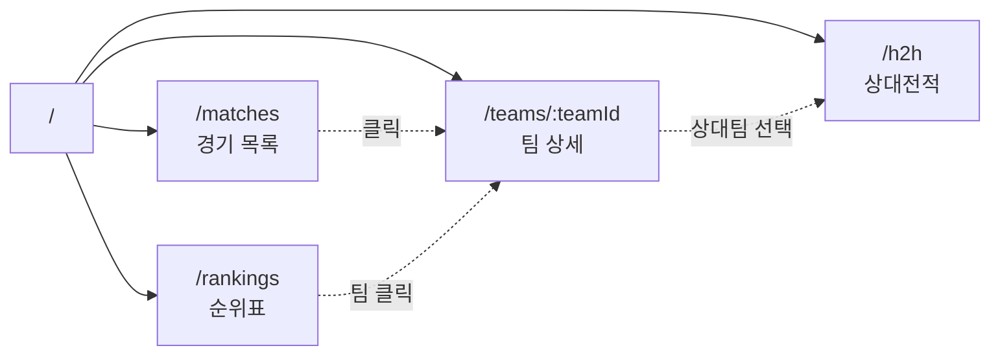
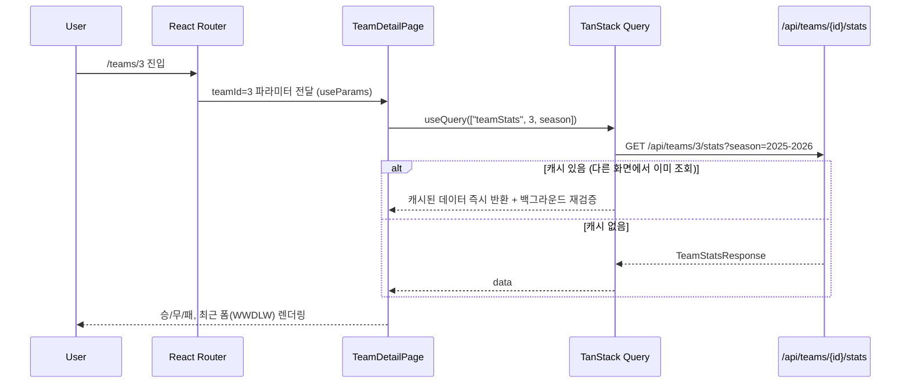

# FotData 프론트엔드 설계

스택: **React + Vite + React Router + TanStack Query**, 백엔드(`Bn/`, 포트 8080)와 분리 배포. 프론트는 `Fn/`에 위치, 기본 포트 5173(Vite 기본값, 백엔드 CORS에 이미 등록됨).

## 1. 리그 / 팀 목록 API (해결됨)

과거엔 `leagueId`/`teamId`를 파라미터로 받는 API만 있고 목록 조회 API가 없었으나, `LeagueController`를 추가해 해결했다.

| API | 설명 |
|---|---|
| `GET /api/leagues` | 리그 목록 (id, code, name) |
| `GET /api/leagues/{leagueId}/teams` | 특정 리그의 팀 목록 (id, name, crestUrl) |

프론트는 이제 "리그 선택 → 해당 리그 팀 목록 → 팀 선택" 흐름을 그대로 구현할 수 있다.

## 2. 화면 구조 (라우트 맵)



| 라우트 | 화면 | 사용 API |
|---|---|---|
| `/matches` | 리그/라운드별 경기 목록 | `GET /api/leagues`, `GET /api/matches?leagueId&matchday` |
| `/rankings` | 득점왕/실점 순위 | `GET /api/leagues`, `GET /api/analysis/rankings/top-scorers`, `/top-conceders` |
| `/teams/:teamId` | 팀 시즌 성적 (승/무/패, 최근 폼, 홈/원정 득실) | `GET /api/teams/{teamId}/stats?season` |
| `/h2h` | 두 팀 상대전적 + 최근 맞대결 | `GET /api/leagues/{id}/teams`, `GET /api/analysis/h2h?teamAId&teamBId` |

첫 화면(`/`)은 `/matches`로 리다이렉트. 관리자 동기화(`POST /api/admin/sync`)는 사용자 화면이 아니라 운영자 전용이므로 프론트 UI에 노출하지 않는다(필요하면 curl/Postman으로 직접 호출).

## 3. 폴더 구조

```
Fn/
├── src/
│   ├── main.tsx                 # 앱 진입점, QueryClientProvider + RouterProvider
│   ├── router.tsx                # 라우트 정의
│   ├── api/
│   │   ├── client.ts              # fetch 래퍼 (base URL, 에러 처리 공통화)
│   │   ├── matches.ts              # GET /api/matches
│   │   ├── teamStats.ts            # GET /api/teams/{id}/stats
│   │   └── analysis.ts             # rankings, h2h
│   ├── features/
│   │   ├── matches/
│   │   │   ├── MatchListPage.tsx
│   │   │   └── MatchCard.tsx
│   │   ├── rankings/
│   │   │   ├── RankingsPage.tsx
│   │   │   └── RankingTable.tsx
│   │   ├── team/
│   │   │   ├── TeamDetailPage.tsx
│   │   │   └── RecentFormBadges.tsx
│   │   └── h2h/
│   │       ├── H2HPage.tsx
│   │       └── TeamPicker.tsx
│   ├── components/                # 여러 feature가 공유하는 순수 UI
│   │   ├── Layout.tsx
│   │   ├── LoadingState.tsx
│   │   └── ErrorState.tsx
│   └── types/
│       └── api.ts                 # 백엔드 DTO와 1:1 대응하는 타입
├── index.html
├── vite.config.ts
└── package.json
```

`features/`는 화면 단위(도메인)로 묶고, 여러 화면이 공유하는 것만 `components/`로 뺀다. `api/`는 fetch 호출만 담당하고 TanStack Query 훅은 각 feature 파일 안에서 직접 `useQuery`로 감싼다 — 훅을 미리 추상화하지 않는다(화면이 3~4개뿐이라 공용 훅 레이어는 과함).

## 4. 타입 — 백엔드 DTO 매핑

`Bn/src/main/java/com/fotdata/dto/response/*.java`를 그대로 옮긴다. 필드명이 백엔드와 다르면 나중에 diff 추적이 어려워지므로 이름을 그대로 맞춘다.

```ts
// types/api.ts
export type MatchStatus = "SCHEDULED" | "LIVE" | "FINISHED" | "POSTPONED" | "CANCELLED";

export interface MatchResponse {
  id: number;
  leagueName: string;
  homeTeamName: string;
  awayTeamName: string;
  matchDate: string;      // LocalDateTime → ISO string
  status: MatchStatus;
  homeScore: number | null;
  awayScore: number | null;
  matchday: number;
}

export interface TeamStatsResponse {
  teamId: number;
  teamName: string;
  season: string;         // "2025-2026"
  played: number;
  win: number;
  draw: number;
  lose: number;
  goalsFor: number;
  goalsAgainst: number;
  homeGoalDifference: number;
  awayGoalDifference: number;
  recentForm: string;     // "WWDLW"
}

export interface RankingResponse {
  teamId: number;
  teamName: string;
  goalsFor: number;
  goalsAgainst: number;
}

export interface H2HResponse {
  teamAId: number;
  teamBId: number;
  teamAWins: number;
  teamBWins: number;
  draws: number;
  recentMatches: MatchResponse[];
}

export interface LeagueResponse {
  id: number;
  code: string;
  name: string;
}

export interface TeamResponse {
  id: number;
  name: string;
  crestUrl: string | null;
}
```

`matchDate`는 백엔드가 `LocalDateTime`(타임존 없음, `MatchSyncService`에서 이미 Asia/Seoul로 변환해 저장)이라 JSON으로는 `"2025-09-01T00:00:00"` 형태로 온다. 프론트에서 별도 타임존 변환 없이 그대로 표시하면 된다.

## 5. 데이터 흐름 예시 — 팀 상세 페이지



`season`은 URL 쿼리스트링(`?season=2025-2026`)으로 관리해 뒤로가기/새로고침에도 유지되게 한다. 시즌 선택 UI는 셀렉트박스 하나로 충분(과거 시즌 조회 API가 없으므로 현재 시즌 고정도 가능 — 이 부분은 스코프 확인 필요).

## 6. 에러/로딩 처리 원칙

- `GlobalExceptionHandler`가 400(검증 실패)/404(리소스 없음)을 내려주므로, 프론트 공통 `ErrorState` 컴포넌트가 상태 코드별 메시지를 분기 처리
  - 404 → "팀 정보를 찾을 수 없어요" (존재하지 않는 teamId)
  - 400 → "잘못된 요청이에요" (시즌 형식 오류 등, 사용자 입력으로는 거의 발생 안 함 — 셀렉트박스로만 시즌을 고르게 하면 원천 차단 가능)
- 로딩 중엔 스켈레톤이 아니라 심플한 스피너로 시작 (화면이 단순해서 스켈레톤은 과함)

## 7. 다음 단계

1. `Fn/`에 `npm create vite@latest . -- --template react-ts` 로 스캐폴딩
2. `api/client.ts` 공통 fetch 래퍼부터 구현 (base URL은 `.env`의 `VITE_API_BASE_URL`)
3. 화면 중 데이터 의존성이 가장 적은 `/matches`부터 구현
