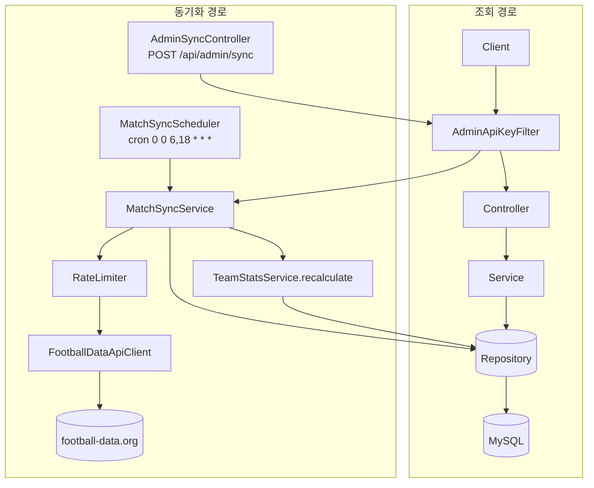

# FotData

해외축구(EPL·라리가·세리에A·분데스리가·리그1·UEFA 챔피언스리그) 경기 데이터를 수집·분석해 순위, ELO 레이팅, 승부 예측을 제공하는 웹 서비스.

## 목차

- [프로젝트 개요](#프로젝트-개요)
- [기술 스택](#기술-스택)
- [주요 기능](#주요-기능)
- [아키텍처](#아키텍처)
- [API 목록](#api-목록)
- [폴더 구조](#폴더-구조)
- [실행 방법](#실행-방법)
- [배포 계획](#배포-계획)
- [트러블슈팅](#트러블슈팅)

## 프로젝트 개요

[football-data.org](https://www.football-data.org/) API로 6개 대회의 경기 데이터를 동기화하고, 이를 바탕으로 팀 성적·상대전적·ELO 순위를 계산하며, 몬테카를로 시뮬레이션으로 경기 승률·시즌 순위·득점왕을 예측한다.

- **기간**: 2026.07 ~ 2026.08
- **백엔드**: `Bn/` (Spring Boot, 포트 8080)
- **프론트엔드**: `Fn/` (React + Vite, 포트 5173)

## 기술 스택

**백엔드**


**프론트엔드**


## 주요 기능

| 기능 | 설명 |
|---|---|
| 경기 목록 조회 | 리그/시즌/라운드별 경기, 실시간(LIVE) 경기 조회 |
| 팀 성적 조회 | 시즌별 승/무/패, 득실점, 최근 5경기 폼 |
| 순위표 | 득점왕/실점 순위, 선수 개인 득점 순위 |
| 상대전적(H2H) | 두 팀 간 통산 전적 + 최근 맞대결 |
| ELO 레이팅 | 체스식 ELO를 축구용으로 변형(홈 어드밴티지 보정)한 팀 랭킹 |
| 경기 승률 예측 | ELO 차이 기반 승/무/패 확률 계산 |
| 시즌 순위 예측 | 잔여 일정을 ELO 승률로 2,000회 몬테카를로 시뮬레이션 → 평균 순위/우승 확률/강등 확률 |
| 득점왕 예측 | 경기당 득점률 × 예상 잔여 경기 수 |
| 관리자 동기화 | 리그별 수동 동기화 API + 하루 2회(06:00, 18:00) 자동 배치 |

UEFA 챔피언스리그는 토너먼트 방식이라 리그전 전제로 설계된 시즌 순위·득점왕 예측에서는 제외했다(경기 조회·ELO는 포함).

## 아키텍처



계층 구조, 동기화 시퀀스 등 상세 다이어그램은 [Docs/backend-architecture.md](Docs/backend-architecture.md), 프론트엔드 라우트/폴더 설계는 [Docs/frontend-design.md](Docs/frontend-design.md) 참고.

## API 목록

| Method | Path | 설명 |
|---|---|---|
| GET | `/api/leagues` | 리그 목록 |
| GET | `/api/leagues/{leagueId}/teams` | 리그 소속 팀 목록 |
| GET | `/api/matches` | 리그/시즌/라운드별 경기 목록 |
| GET | `/api/matches/recent` | 최근 종료 경기 |
| GET | `/api/matches/live` | 실시간 경기 |
| GET | `/api/teams/{teamId}/stats` | 팀 시즌 성적 |
| GET | `/api/teams/{teamId}/elo` | 팀 ELO 레이팅 |
| GET | `/api/analysis/rankings/top-scorers` | 팀 득점 순위 |
| GET | `/api/analysis/rankings/top-conceders` | 팀 실점 순위 |
| GET | `/api/analysis/elo-rankings` | ELO 순위 |
| GET | `/api/analysis/player-scorers` | 선수 개인 득점 순위 |
| GET | `/api/analysis/h2h` | 두 팀 상대전적 |
| GET | `/api/predictions/match` | 경기 승/무/패 확률 예측 |
| GET | `/api/predictions/season` | 시즌 순위 예측(우승/강등 확률) |
| GET | `/api/predictions/top-scorers` | 득점왕 예측 |
| POST | `/api/admin/sync` | 리그 수동 동기화 (관리자 전용, `X-Admin-Key` 헤더 필요) |

검증 실패는 400, 존재하지 않는 리소스는 404로 `GlobalExceptionHandler`가 일괄 변환한다.

## 폴더 구조

```
FotData/
├── Bn/                          # 백엔드 (Spring Boot)
│   └── src/main/java/com/fotdata/
│       ├── controller/
│       ├── service/
│       ├── entity/
│       ├── repository/
│       ├── dto/
│       ├── scheduler/
│       └── config/               # CORS 등 설정
├── Fn/                          # 프론트엔드 (React + Vite)
│   └── src/
│       ├── api/                  # fetch 래퍼 + 엔드포인트별 호출 함수
│       ├── features/             # 화면 단위 (matches, rankings, team, h2h, predictions, home)
│       ├── components/           # 여러 화면이 공유하는 UI
│       ├── types/                # 백엔드 DTO 매핑 타입
│       └── lib/                  # 공용 유틸리티
└── Docs/                        # 아키텍처 설계 문서
```

## 실행 방법

**백엔드**
```bash
cd Bn
# 환경변수: FOOTBALL_DATA_API_TOKEN, ADMIN_API_KEY 설정 필요
./gradlew bootRun
```

**프론트엔드**
```bash
cd Fn
npm install
npm run dev
```

## 배포 계획

클라우드 VM 1대에 Docker로 백엔드·DB·프론트를 함께 올리는 방식으로 배포 예정 (아직 진행 전).

1. 보안 정리 (아래 항목)
2. 백엔드 컨테이너화 (Dockerfile)
3. DB 준비 (docker-compose MySQL)
4. 프론트 빌드 설정 (API base URL 환경변수 분리)
5. 프론트 컨테이너화 또는 Nginx 정적 서빙
6. docker-compose로 로컬 통합 테스트
7. VM 프로비저닝 (SSH, Docker/Compose 설치)
8. VM 배포 및 접속 확인
9. 스케줄러·환경변수 최종 점검 (배치 동기화 로그 확인)

**배포 전 필수 보안/설정 정리 항목**
- `application.properties`의 DB 비밀번호 기본값 제거 — 환경변수 필수화
- CORS 허용 origin에 배포 도메인 추가 (`CORS_ALLOWED_ORIGINS`)
- 백엔드/프론트 Dockerfile 작성 (현재 없음)
- 필요 환경변수: `FOOTBALL_DATA_API_TOKEN`, `ADMIN_API_KEY`, `DB_USERNAME`, `DB_PASSWORD`, `CORS_ALLOWED_ORIGINS`

## 트러블슈팅

- **같은 라운드에 다른 시즌 경기가 섞여 조회되던 문제** — 경기를 리그+라운드로만 구분하고 시즌을 구분하지 않아 발생. 시즌 컬럼을 추가하고 조회 조건에 포함해 해결.
- **과거 시즌 동기화 시 팀 성적이 갱신되지 않던 문제** — 새로 생성되는 경기가 곧바로 '종료' 상태로 만들어지면서 '새로 종료된 경기인지' 판단 로직이 이를 놓침. 기존 경기 존재 여부를 먼저 조회해 판단 기준으로 삼도록 순서를 변경해 해결.
- **UEFA 챔피언스리그 동기화 시 저장 실패** — 토너먼트 단계 경기는 라운드 번호가 없는데 해당 컬럼이 필수값이었음. 컬럼을 선택값으로 바꾸고 DB 스키마도 함께 수정.
- **강등된 팀이 새 시즌 순위 예측에 포함되던 문제** — 팀의 리그 소속 정보가 고정값이라 승격·강등을 반영하지 못함. 예측 대상을 리그 소속 팀 전체가 아니라 실제 해당 시즌 경기 일정에 등장하는 팀만으로 한정해 해결.
- **UEFA 챔피언스리그에 리그전 기준 예측 로직을 그대로 적용해 비현실적인 값이 나오던 문제** — 예측 API에 대회 방식 검증을 추가해 토너먼트 대회는 명확한 에러 메시지와 함께 차단.
- **경기 승률 예측·상대전적 조회에서 같은 팀을 양쪽에 선택해도 결과가 나오던 문제** — 경기 예측은 두 팀이 동일하면 ELO 차이가 0이라 계산은 되지만 의미 없는 확률이 나왔고, 상대전적도 같은 팀끼리는 존재할 수 없는 경기인데도 "0승 0무 0패"가 그대로 표시됨. 두 기능 모두 백엔드에서 동일 팀 요청을 차단하고, 프론트에서도 같은 팀을 선택하면 안내 문구를 보여주도록 이중으로 방어.
